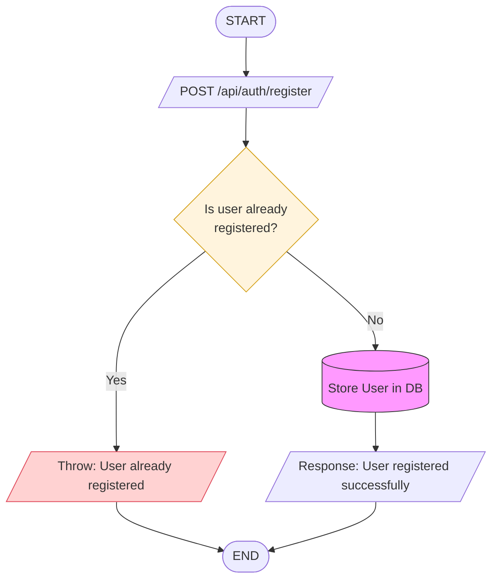
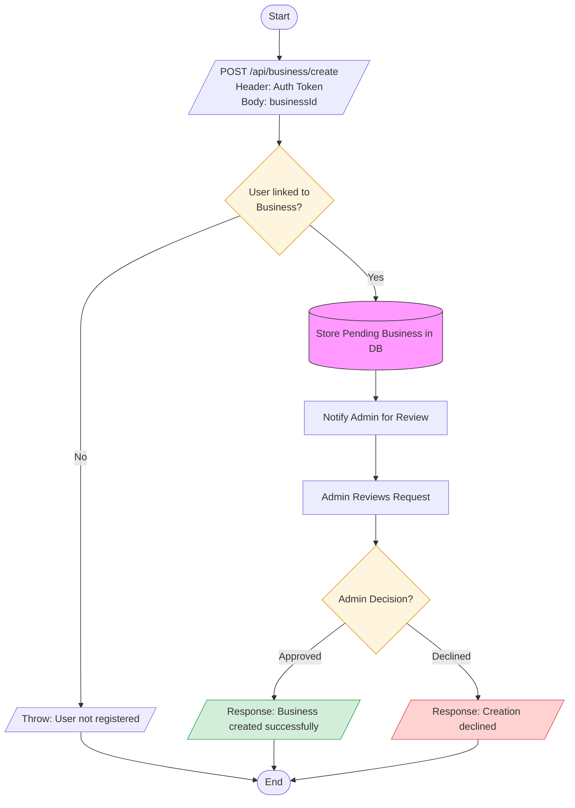
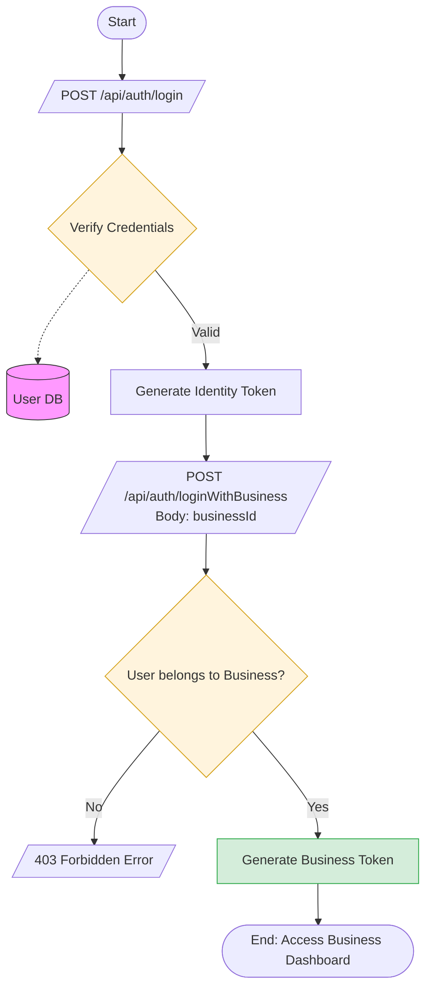
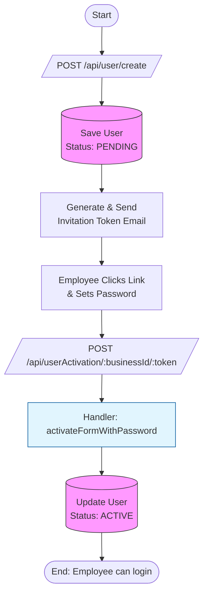

# BUSINESS ONBOARDING LIFECYCLE

This document outlines the complete technical flow for user registration, business initialization, authentication, and team expansion.

## Owner Registration Flow

This flow handles the initial creation of a user identity in the system.

## Business Initialization & Approval

Once an identity exists, an owner can request to create a business entity, subject to admin verification.

## Two-Step Business Authentication

Accessing the dashboard requires a two-stage token exchange to establish identity and then business context.

## Employee Onboarding (Invitation Flow)

Owners can invite employees, who must activate their accounts via a secure token.

